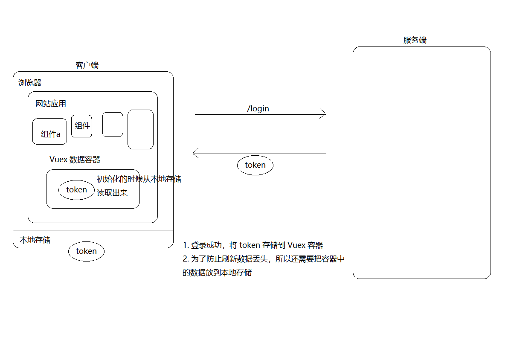

# Vue项目开发步骤及常用封装方法

## Vue项目初始化

###  使用 Vue CLI 初始化项目

> 在命令行中输入以下命令创建 Vue 项目：

```js
vue create 项目名称
```

```js
Vue CLI v3.11.0
? Please pick a preset:
  default (babel, eslint)
> Manually select features
```

> 选择第2种：手动选择特性，支持更多自定义选项。

```js
? Please pick a preset: Manually select features
? Check the features needed for your project:
 (*) Babel
 ( ) TypeScript
 ( ) Progressive Web App (PWA) Support
 (*) Router
 (*) Vuex
 (*) CSS Pre-processors
>(*) Linter / Formatter
 ( ) Unit Testing
 ( ) E2E Testing
```

> 分别选择：
>
> Babel：es6 转 es5
>
> Router：路由
>
> Vuex：容器
>
> CSS Pre-processors：CSS预处理器
>
> Linter / Formatter：代码格式校验

> 是否使用 history 路由模式，这里输入 n 不使用。

```js
? Use history mode for router? (Requires proper server setup for index fallback in production) (Y/n) n
```

> 选择 CSS 预处理器，这里选择我们用的的 Less。

```js
? Pick a CSS pre-processor (PostCSS, Autoprefixer and CSS Modules are supported by default):

  Sass/SCSS (with dart-sass)
  Sass/SCSS (with node-sass)
> Less
  Stylus
```

> 选择校验工具，这里选择 ESLint + [Standard config](https://standardjs.com/)  双重校验。

```js
? Pick a linter / formatter config:
  ESLint with error prevention only
  ESLint + Airbnb config
> ESLint + Standard config
  ESLint + Prettier
```

> 选择在什么时机下触发代码格式校验：
>
> - Lint on save：每当保存文件的时候；
> - Lint and fix on commit：每当执行 `git commit` 提交的时候；
>
> 这里建议两个都选上，更严谨。

```js
? Where do you prefer placing config for Babel, PostCSS, ESLint, etc.? (Use arrow keys)
> In dedicated config files
  In package.json
```

> Babel、ESLint 等工具会有一些额外的配置文件，这里的意思是问你将这些工具相关的配置文件写到哪里：
>
> - In dedicated config files：分别保存到单独的配置文件；
> - In package.json：保存到 package.json 文件中；
>
> 这里选择第1个，保存到单独的配置文件，方便我们做自定义配置。

```js
? Where do you prefer placing config for Babel, PostCSS, ESLint, etc.? (Use arrow keys)
> In dedicated config files
  In package.json
```

> 这里是问你是否需要将刚才选择的一系列配置保存起来，然后它可以帮你记住上面的一系列选择，以便下次直接重用。
>
> 这里根据自己需要输入 y 或者 n，我这里输入 n 不需要。

```js
? Save this as a preset for future projects? (y/N) n
```

> 向导配置结束，开始装包。
>
> 安装结束，命令提示你项目创建成功，按照命令行的提示在终端中分别输入：
>
> - `cd 你的项目`
> - `npm run serve`

## 调整目录结构

项目创建好以后，下面我们来了解一下目录结构的含义：

```
├── babel.config.js	babel配置文件
├── package-lock.json	npm相关文件
├── package.json	npm相关文件
├── postcss.config.js	postcss配置文件
├── public	静态资源托管目录
│   ├── favicon.ico
│   └── index.html
├── README.md	项目说明文件
└── src	源码
    ├── api	请求接口封装模块
    ├── App.vue	根组件
    ├── assets	资源目录
    ├── components	组件目录
    ├── main.js	入口文件
    ├── router	路由模块
    ├── store	 Vuex容器模块
    ├── styles 样式目录
    ├── utils  工具模块目录
    └── views  视图组件目录
```

### 调整App.vue

```
<template>
  <div id="app">
    <router-view />
  </div>
</template>

<script></script>

<style></style>
```

### 配置路由

删除默认生成的 `src/router.js`，然后创建 `src/router/index.js` 并写入以下内容：

```
import Vue from 'vue'
import Router from 'vue-router'
Vue.use(Router)
export default new Router({
  routes: []
})
```

> 路由懒加载
>
> {
>       name: 'home',
>       path: '/',
>       component: () => import('@/views/search-result')
>     }

## npm 和 yarn

> npm 和 yarn 常用命令对照表：

```js
# yarn init
npm init

# yarn add 包名
npm install 包名

# yarn install 或者直接 yarn
npm install

# yarn add -D 包名
npm install -D 包名

# yarn remove 包名
npm uninstall 包名

# yarn global remove 包名
npm uninstall --global 包名

# yarn global add 包名
npm install --global 包名
```

> 如果你想切换项目使用的包管理工具：
>
> 1、删除 node_modules
>
> 2、删除 yarn.lock/package-lock.json
>
> 3、使用你要使用的新的包管理工具把所有依赖重新安装一遍。
>
> - yarn
> - npm install
>
> 4、之后就可以正常使用了。

## 加入Git版本管理

> 正常的话我们需要创建仓库并提交历史记录：

```
git init
git add 文件
git commit "提交日志"
```

> Vue CLI 生成的项目默认完成了Git仓库的初始化和一次提交，所以这里只需要 push 到线上即可。
>
> Git 只能管理文件，对于空目录不会进行版本管理，所以建议在空目录中添加一个 `.gitkeep` 空文件以保持提交历史中的目录结构。

```
git remote add 远程仓库地址
git push -u origin master
```

> 之后如果需要提交，则直接：

```
git add .
git commit -m "提交日志"
git push
```

## 封装axios请求函数

> 把 axios 封装为一个请求模块，在需要的时候直接加载使用。

1、安装axios

```js
npm i axios
```

2、创建 `utils/request.js` 并写入以下代码

```js
import axios from 'axios'

// axios.create 方法
// 建议使用 create 方式，我们可以拥有
// 说白了就是复制了一个 axios，拥有和 axios 完全一样的功能，但是配置可以不一样
// 例如我们可以创建多个请求对象，而不同的请求对象拥有不同的 baseURL
// 例如我们可以有 a 请求的拦截器，也可以专门定制 b 请求的拦截器
const request = axios.create({
  baseURL: 'http://api/abcd.cn'
})
export default request
```

##  处理后端返回数据超出 JS 安全整数范围问题

> 项目所使用的后端接口数据中包含超出 JavaScript 安全整数范围的数字，所以也需要像之前的 PC 端项目一样使用 [json-bigint](https://github.com/sidorares/json-bigint) 将后端返回数据处理一下才能正确使用。

1、安装依赖：

```js
npm i json-bigint
```

2/在 `utils/request.js` 中新增：

```js
/**
 * axios 请求相关操作封装到这里
 */
import axios from 'axios'
+ import jsonBig from 'json-bigint'

const request = axios.create({
  // 请求的基础路径
  baseURL: 'http://api/abcd.cn/'
})

/**
 * 配置处理后端返回数据中超出 js 安全整数范围问题
 */
+ request.defaults.transformResponse = [function (data) {
+  return data ? jsonBig.parse(data) : {} // 换了一个转化方法 使得 计算更精确 保证id不失真
+ }]

/**
 * 请求拦截器
 */

/**
* 响应拦截器
*/

// 导出这个请求对象，哪里需要发请求，哪里就加载使用
export default request
```

## 封装api请求模块

> 我们将所有请求都封装为函数的方式来进行使用，这样做的主要目的是为了便于重用和维护。

1、创建 `api/user.js` 并写入

```js
import request from '@/utils/request'
/**
* 登录
export const login = (user)=> {
  return request({
    // method 用来指定请求方法，这是 axios 的固定 API，不能瞎写
    method: 'POST',
    // url 用来指定请求路径
    url: '/app/v1_0/login',
    // data 是 axios 请求要求的字段名，用来传递请求体数据的
    data: user
  })
}
```

2、然后在页面中加载调用：

```
 import { login } from '@/api/user'

async onLogin () {
  try {
    // 请求提交表单数据
    const { data } = await login(this.user)
  } catch (err) { 
  // 所有大于等于 400 的状态码都会进入 catch 
  }
}
```

## Vue表单验证插件

> 方式：使用专门的验证插件或者框架自带验证功能

- [vuelidate](https://github.com/monterail/vuelidate)
- [VeeValidate](https://github.com/baianat/vee-validate)

> 使用 VeeValidate 为例 

### 安装和配置

1、安装

```js
# yarn add vee-validate
npm install vee-validate
```

2、在 `main.js` 中

```
import { ValidationProvider, ValidationObserver, extend } from 'vee-validate'
import zhCN from 'vee-validate/dist/locale/zh_CN' // 加载验证插件的语言包
import * as rules from 'vee-validate/dist/rules'

// 配置使用中文语言
for (let rule in rules) {
  extend(rule, {
    ...rules[rule], // add the rule
    message: zhCN.messages[rule] // add its message
  })
}

// 注册为全局组件
Vue.component('ValidationProvider', ValidationProvider)
Vue.component('ValidationObserver', ValidationObserver)
```

###  基本使用

在模板中为需要验证的表单字段配置验证规则：（开发日常中请参考文档）

```js
举例：<!-- 登录表单 -->
+ <ValidationObserver ref="loginForm">
  <van-cell-group>
    <!--
      name 提示的文本
      rules 验证规则
        required 必填项
        email
        max
        ....
        参考文档：https://logaretm.github.io/vee-validate/api/rules.html#alpha

      v-slot="{ errors }" 获取校验结果数据
        errors[0] 读取校验结果的失败信息
      -->
    <!-- <ValidationProvider name="手机号" rules="required|email|max:5" v-slot="{ errors }"> -->
+    <ValidationProvider name="手机号" rules="required" v-slot="{ errors }">
      <van-field
        v-model="user.mobile"
        required
        clearable
        label="手机号"
        placeholder="请输入手机号"
+        :error-message="errors[0]"
      />
+    </ValidationProvider>

+    <ValidationProvider name="验证码" rules="required|max:6" v-slot="{ errors }">
      <van-field
        v-model="user.code"
        type="password"
        label="验证码"
        placeholder="请输入验证码"
        required
+        :error-message="errors[0]"
      />
+    </ValidationProvider>
   </van-cell-group>
+ </ValidationObserver>
<!-- /登录表单 -->
```

当表单提交的时候，调用 js 进行验证

```js
async onLogin () {
  // 表单验证
+  const isValid = await this.$refs.loginForm.validate()

+  // 如果验证失败，阻止表单提交
+  if (!isValid) {
+    return
+  }

  ...
}
```

如何自定义扩展校验规则，在 `main.js` 中：

```js
// 扩展自定义校验规则
// extend('规则名称', 配置对象)
extend('phone', {
  // 验证方法，value 是需要校验的数据，返回一个布尔值，表示验证成功与否
  validate: function (value) {
    return /^1\d{10}$/.test(value)
  },
  // 错误提示消息
  message: '请输入有效的手机号码'
})
```

## Token处理

> - 为了方便获取：我们放到 Vuex 容器中：
>   - 组件中无论是直接通过 js 来获取还是直接在模板中获取都非常方便。
>   - $store。
>   - 如果只是纯粹的放到本地存储，那我在使用的时候，首先读取出来，然后放到 data 中，然后才能在模板中使用。
> - 为了防止刷新丢失：我们会把数据存储到本地存储。



###  使用 Vuex 容器存储 token

1、在 `store/index.js` 中：

```js
import Vue from 'vue'
import Vuex from 'vuex'
Vue.use(Vuex)

export default new Vuex.Store({
  state: {
    user: null
  },
  mutations: {
    setUser (state, user) {
      state.user = user
    }
  }
})
```

2、登录成功以后将数据存储到容器中。

```js
async onLogin () { 
  // 登录成功，将数据存储到容器中
  this.$store.commit('setUser', data.data)
}
```

###  持久化 token

> Vuex 容器中的数据只是为了方便在其他任何地方能方便的获取登录状态数据，但是页面刷新还是会丢失数据状态，所以我们还要把数据进行持久化中以防止页面刷新丢失状态的问题。
>
> 前端持久化常见的方式就是：
>
> - 本地存储
> - Cookie
>
> 这里我们以使用本地存储持久化用户状态为例。

### 封装储存模块

1、创建 `src/utils/storage.js` 并写入以下内容。

```js
export const getItem = name => {
  return JSON.parse(window.localStorage.getItem(name))
}

export const setItem = (name, data) => {
  return window.localStorage.setItem(name, JSON.stringify(data))
}

export const removeItem = name => {
  window.localStorage.removeItem(name)
}
```

2、然后在登录成功以后，将 token 存储到本地存储。

```js
+ import { setItem } from '@/utils/storage'

async onLogin () {
  ...
  // 登录成功，将数据存储到容器中
  this.$store.commit('setUser', data.data)
  
  // 为了防止页面刷新数据丢失，将数据存储到本地存储
+  setItem('user', data.data)
}
```

3、最后，在容器中使用本地存储中的数据进行初始化。

```js
import Vue from 'vue'
import Vuex from 'vuex'
+ import { getItem } from '@/utils/storage'
Vue.use(Vuex)

export default new Vuex.Store({
  state: {
    // 初始化的时候从本地存储获取数据，没有就是 null
+    user: getItem('user')
  },
  mutations: {
    setUser (state, user) {
      state.user = user
    }
  }
})
```

##  使用请求拦截器统一添加 token

> 很多接口都需要提供 token 才能访问，所以我们使用请求拦截器统一添加token。

1、在 `utils/request.js` 中添加拦截器统一设置 token：

```js
...
// 非组件模块访问容器直接加载即可
// 这里得到的 store 和组件中访问的 this.$store 是一个东西
import store from '@/store'

/**
 * 请求拦截器，请求到达后台之前拦截
 */
request.interceptors.request.use(function (config) {
  // 在发起请求请做一些业务处理
  // config是要发送请求的配置信息
  const user = store.state.user
  if (user) {
    // Authorization 是后端要求的名字，不能瞎写
    // 数据值 "Bearer空格token" 也是后端要求的数据格式，不能瞎写（开发中按照后台token的格式来）
    // 什么意义？这是后端要求的，我们决定不了。
    config.headers['Authorization'] = `Bearer ${user.token}` 
    // 统一注入token 到headers属性 因为所有接口要求的token格式是一样的
  }
  return config
}, function (error) {
  // 对请求失败做处理
  return Promise.reject(error)
})
```

###  处理 token 过期

> 过期处理方式：
>
> - 通过登录页面重新登录获取 token；
> - 使用 refresh_token 重新获取新的 token；


```js
/**
 * axios 请求相关操作封装到这里
 */
import axios from 'axios'
import jsonBig from 'json-bigint'

// 在非组件模块中使用容器就直接加载即可
// 这里获取到的 store 和你在组件中的 this.$store 是一个东西
import store from '@/store'

// 非组件模块使用路由就直接加载即可
// 如果加载目录下的 index.js ，则可以省略文件名
+ import router from '@/router'

// 之前是这样写的
// axios.defaults.baseURL = 'xxx'
// 之前也是直接使用 axios 发送请求
// 为了方便，把 axios 挂载到了 Vue 的原型对象上了
// this.$axios

// axios.create 方法返回一个请求对象，这个请求对象的功能和 axios 的功能是一样的
// 也就是说我们复制了一个 axios
// 为什么要单独复制一个 axios 出来？
// 因为有时候我们需要单独定制不同的请求
// 例如有的项目中有多个请求地址
//      http://a.com
//      http://b.com
// axios.defaults.baseURL = 'xxx'
// 所以推荐这么做
const request = axios.create({
  // 请求的基础路径
  baseURL: 'http://ttapi.research.itcast.cn/'
})

/**
 * 配置处理后端返回数据中超出 js 安全整数范围问题
 */
request.defaults.transformResponse = [function (data) {
  return data ? jsonBig.parse(data) : {} // 换了一个转化方法 使得 计算更精确 保证id不失真
}]

/**
 * 请求拦截器，请求到达后台之前拦截
 */
request.interceptors.request.use(function (config) {
  // 在发起请求请做一些业务处理
  // config是要发送请求的配置信息
  const user = store.state.user
  if (user) {
    // Authorization 是后端要求的名字，不能瞎写
    // 数据值 "Bearer空格token" 也是后端要求的数据格式，不能瞎写
    // 千万!千万!千万!注意，Bearer 和 token 之间的空格不能少
    // 什么意义？这是后端要求的，我们决定不了。
    config.headers['Authorization'] = `Bearer ${user.token}` 
    // 统一注入token 到headers属性 因为所有接口要求的token格式是一样的
  }
  return config
}, function (error) {
  // 对请求失败做处理
  return Promise.reject(error)
})

/**
 * 响应拦截器
 */
+++ request.interceptors.response.use(function (response) { // <400 的状态码进入这里
  return response
}, async function (error) { // >= 400 的状态码会进入这里
  console.dir(error)
  // 如果状态码是 401
  if (error.response && error.response.status === 401) {
    const { user } = store.state
    if (!user) {
      // 直接跳转登录页
      router.push({
        name: 'login'
      })
    } else {
      try {
        // 请求获取新的 token
        const { data } = await axios({
          method: 'PUT',
          url: 'http://ttapi.research.itcast.cn/app/v1_0/authorizations',
          headers: {
            Authorization: `Bearer ${user.refresh_token}`
          }
        })

        // 将最新的 token 替换原有 token
        store.commit('setUser', {
          token: data.data.token, // 最新获取的
          refresh_token: user.refresh_token // 还是原来的
        })

        // 将原来失败的请求继续发出去
        return request(error.config)
      } catch (err) {
        console.log(err)
        // 刷新 token 也失败了，直接跳转到登录页
        router.push({
          name: 'login'
        })
      }
    }
  }
  // 如果有 refresh_token，则请求刷新 token
  return Promise.reject(error)
})

// 导出这个请求对象，哪里需要发请求，哪里就加载使用
export default request
```

```js
// 跳转到之前的页面或首页
this.$router.push(this.$route.query.redirect || '/')
```

##  时间处理

> [moment](https://github.com/moment/moment) 和 [dayjs](https://github.com/iamkun/dayjs) 都可以处理相对时间，这里我们以使用 dayjs 为例。
>
> - moment 功能更强大一些；
> - dayjs 的设计是参照的 moment，所以无论你使用哪个一个，上手另一个都一样；
> - dayjs 好处是比 moment 小很多;

1、安装依赖

```
npm i dayjs
```

2、创建 `utils/date.js` 并写入以下代码

```js
/**
 * 专门处理时间的工具模块
 */
import dayjs from 'dayjs'
import 'dayjs/locale/zh-cn'
import rTime from 'dayjs/plugin/relativeTime'
import Vue from 'vue'
dayjs.extend(rTime)
dayjs.locale('zh-cn')

Vue.filter('relativeTime', value => {
  return dayjs().from(dayjs(value))
})

// 我们把处理时间的代码都封装成一个一个的小函数，然后在需要的时候加载调用
// export xxx
```

3、然后在模板中使用

```
...
<!--
	过滤器的本质作用：就是为模板提供一个函数进行调用
	过滤器是函数，使用过滤器就是在调用函数
	| 前面的会作为参数传递给过滤器函数
	过滤器函数的返回值将渲染到这里
-->
<span>{{ article.pubdate | relativeTime }}</span>
```

## Vue作用域

> [关于作用域样式的说明](https://vue-loader.vuejs.org/zh/guide/scoped-css.html)：
>
> - 如果没有 scoped，样式会作用到全局
>
> - 当 `<style>` 标签有 `scoped` 属性时，它的 CSS 只作用于当前组件中的元素
>
> - 使用 `scoped` 后，父组件的样式将不会渗透到子组件中。不过一个子组件的根节点会同时受其父组件的 scoped CSS 和子组件的 scoped CSS 的影响。这样设计是为了让父组件可以从布局的角度出发，调整其子组件根元素的样式。
>
> - 如果你希望 `scoped` 样式中的一个选择器能够作用得“更深”，例如影响子组件，你可以使用 `>>>` 操作符：
>
>   ```
>   <style scoped>
>   .a >>> .b { /* ... */ }
>   </style>
>   ```
>
>   上述代码将会编译成：
>
>   ```
>   .a[data-v-f3f3eg9] .b { /* ... */ }
>   ```
>
>   有些像 Sass 之类的预处理器无法正确解析 `>>>`。这种情况下你可以使用 `/deep/` 或 `::v-deep` 操作符取而代之——两者都是 `>>>` 的别名，同样可以正常工作。

## 组件缓存

> 参考文档：
>
> - [在动态组件上使用 `keep-alive`](https://cn.vuejs.org/v2/guide/components-dynamic-async.html#在动态组件上使用-keep-alive)

```
<!-- 失活的组件将会被缓存！-->
<keep-alive>
  动态组件
</keep-alive>
```

> 注意：`<keep-alive>` 要求被切换到的组件都有自己的名字，不论是通过组件的 `name` 选项还是局部/全局注册。

### 禁用组件缓存

> 参考文档：
>
> - https://cn.vuejs.org/v2/api/#keep-alive

手动销毁的方式需要修改组件内部的代码，这里介绍一种更灵活的方式来配置哪些组件缓存，哪些组件不缓存。

> **Props**：
>
> - `include` - 字符串或正则表达式。只有名称匹配的组件会被缓存。
> - `exclude` - 字符串或正则表达式。任何名称匹配的组件都不会被缓存。
> - `max` - 数字。最多可以缓存多少组件实例。

`include` 和 `exclude` 属性允许组件有条件地缓存。二者都可以用逗号分隔字符串、正则表达式或一个数组来表示：

```
<!-- 逗号分隔字符串 -->
<keep-alive include="a,b">
  <component :is="view"></component>
</keep-alive>

<!-- 正则表达式 (使用 `v-bind`) -->
<keep-alive :include="/a|b/">
  <component :is="view"></component>
</keep-alive>

<!-- 数组 (使用 `v-bind`) -->
<keep-alive :include="['a', 'b']">
  <component :is="view"></component>
</keep-alive>
```

匹配首先检查组件自身的 `name` 选项，如果 `name` 选项不可用，则匹配它的局部注册名称 (父组件 `components` 选项的键值)。匿名组件不能被匹配。